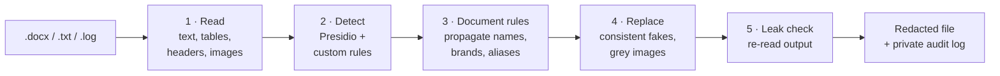
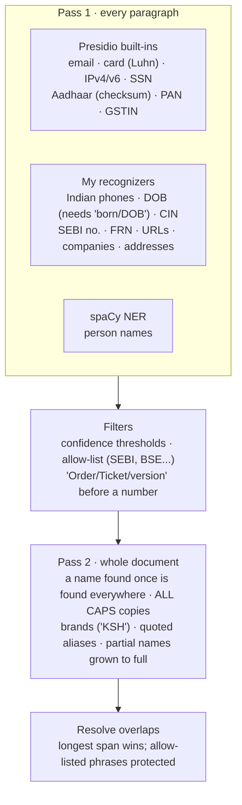

# PII Redaction Tool

**Khushi Gupta** · B.Tech CSE (AIML), 4th year, UPES Dehradun
📧 khushigupttaa04@gmail.com · 📞 +91 99718 21850 · 🌐 **[Live app](https://pii-redaction-tool-khushi.streamlit.app/)** · 📄 **[Redacted output file](https://docs.google.com/document/d/1S5UmBJMnRl3qLkLZrpQAkdfKJGKbUERY/edit?usp=sharing)** · 📊 **[Evaluation report](https://drive.google.com/file/d/1EhxdD9GTSHl54zRUYNXAkXRe4qBc5Vma/view?usp=sharing)**

I built a tool that finds personal and business-identifying information (PII/BII) in Indian securities filings and support ticket logs, and replaces every item with a **consistent, realistic fake** while keeping the document's tables, formatting and meaning intact.

> **Results:** on a held-out test set of the Red Herring Prospectus, **98.4% precision / 96.9% recall**. On 5 unseen prospectuses, **100% precision / 88.1% recall** (redaction-level). Full evaluation: [`eval/report/Pii_redaction_evaluation_report.pdf`](eval/report/Pii_redaction_evaluation_report.pdf).

---

## Architecture

| Component | File | Job |
|---|---|---|
| **Reader / Writer** | `redactor/docx_io.py` | Reads every paragraph (body, tables, headers, footers); writes fakes back into Word's own text runs, so formatting never changes |
| **Detector** | `redactor/detectors.py` | Microsoft Presidio + my India-specific recognizers + document-level rules |
| **Faker** | `redactor/fakes.py` | Consistent fake values: one fake identity per person across all spellings |
| **Image redactor** | `redactor/images.py` | Replaces every embedded image (ID cards, logos, QR code) with a grey box of the same size |
| **Leak check** | `redactor/pipeline.py` | Re-reads the output after every run and lists any real value still present |
| **Web app** | `app.py` | Streamlit: upload → redact → download |
| **Evaluation** | `eval/` | Labelled data, benchmark on 5 unseen prospectuses, tests |

## Workflow



## Methodology: how detection works



**The idea:** trust high-precision signals first (patterns plus validators such as Luhn and Aadhaar checksums, or a required hint word), then use the *whole document* as context. spaCy often misses Indian names, but if it recognises "Rajesh Kushal Hegde" once, the tool catches "KUSHAL SUBBAYYA HEGDE" on the cover too.

## Table 1: What I treated as PII

| ✅ Redacted | ❌ Kept (not PII) |
|---|---|
| Names, emails, phones, addresses, dates of birth | SEBI, BSE, NSE, RBI, NSDL (public regulators and market bodies) |
| SSN, credit cards, IP addresses, PAN, Aadhaar, GSTIN, DIN | Regulator and exchange websites |
| Private companies (banks, lead managers, trusts) and their brand names | Legal terms ("SEBI ICDR Regulations", "Book Running Lead Managers") |
| CIN, SEBI registration numbers, auditor FRNs (a public lookup reveals the firm) | Designations, prices, amounts, filing and meeting dates |
| Company websites, every embedded image (ID cards, logos, QR code) | **Order, ticket and invoice numbers** (operational data, not PII) |

## Evaluation methods

| Method | What it checks | Size |
|---|---|---|
| Hand-labelled prospectus (dev / test) | Real precision and recall; test set never used for tuning | 125 / 75 paragraphs |
| 5 unseen prospectuses | Does it generalise? Tool run unchanged | 100 paragraphs |
| Synthetic ticket log | PII types missing from the prospectus + the ticket-log use case | 18 tickets |
| Injection test | Known fake PII planted in real paragraphs | 180 values |
| Traps | Order numbers, SSN-shaped ticket IDs, version strings, a mistyped Aadhaar | 5 tickets |
| Leak / image / structure checks | Nothing leaks, images replaced, layout intact | whole files |

## Results

| Evaluation set | TP | FP | FN | Precision | Recall | F1 | Accuracy* |
|---|---|---|---|---|---|---|---|
| **Red Herring Prospectus, test (held-out)** | 63 | 1 | 2 | **98.4%** | **96.9%** | **97.7%** | 98.7% |
| Red Herring Prospectus, dev | 61 | 6 | 1 | 91.0% | 98.4% | 94.6% | 98.8% |
| **5 unseen prospectuses, redaction-level** | – | – | – | **100.0%** | **88.1%** | **93.7%** | – |
| 5 unseen prospectuses, strict (type must match) | 32 | 4 | 10 | 88.9% | 76.2% | 82.1% | 97.5% |
| Synthetic ticket log | 29 | 1 | 2 | 96.7% | 93.5% | 95.1% | 97.8% |
| Injection test | 169 / 180 caught | | | – | 93.9% | – | – |

*Token-level accuracy (share of words correctly marked PII / not PII); inflated because most words are not PII.
**File checks:** 0 of 261 replaced values remain · 8/8 images replaced · 1006 paragraphs and 76 tables unchanged.

## Tradeoffs I chose
- **Precision over NER coverage for companies:** companies are found by legal suffix (100+ countries via `cleanco`), not by spaCy's organisation tags, which mark capitalised legal terms ("Mutual Funds", "Fiscals") as companies.
- **Replace every image, not just the PII areas:** masking only detected areas missed the handwritten signature and stylised logos.
- **Brands are redacted:** "CARE" in "CARE Report" is replaced too, favouring recall for a company's identity.

## Next improvements
1. Join the paragraphs of a table cell before detection, since PDF conversion splits names and links across cells (the main cause of misses on unseen prospectuses).
2. A zero-shot NER model (GLiNER, supported by Presidio) for companies named without a legal suffix ("Jain & Chopra, Chartered Accountants").
3. More phone formats (bracketed landlines, spaced mobiles) and addresses without PIN codes.
4. Consistent date shifting, so filing dates plus industry can't re-identify the issuer.
5. An automated audit per document: independent leak checks plus an LLM reviewer, with human review of only the disagreements.

## Run it on your laptop
```bash
pip install -r requirements.txt
python -m redactor.pipeline Red_Herring_Prospectus.docx redacted.docx     # redact + automatic leak check
python -m eval.evaluate Red_Herring_Prospectus.docx redacted.docx         # prospectus, tickets, injection scores
python -m eval.benchmark eval/benchmark_docs                              # 5 unseen prospectuses
python -m pytest tests                                                    # 8 tests
streamlit run app.py                                                      # web app
```
**Add a new PII type:** one line in `RECOGNIZERS` (`redactor/detectors.py`), e.g. `RegexRecognizer("VOTER_ID", r"\b[A-Z]{3}\d{7}\b")`. Presidio's built-ins (e.g. `InPassportRecognizer`) go in the same list.

`redaction_log.json` maps real values to fakes, so it is git-ignored and never shared.

